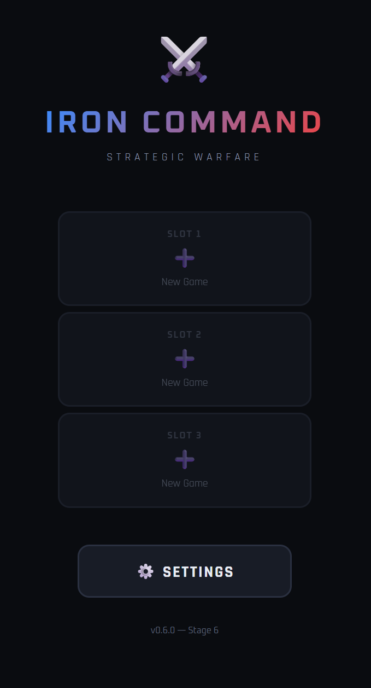
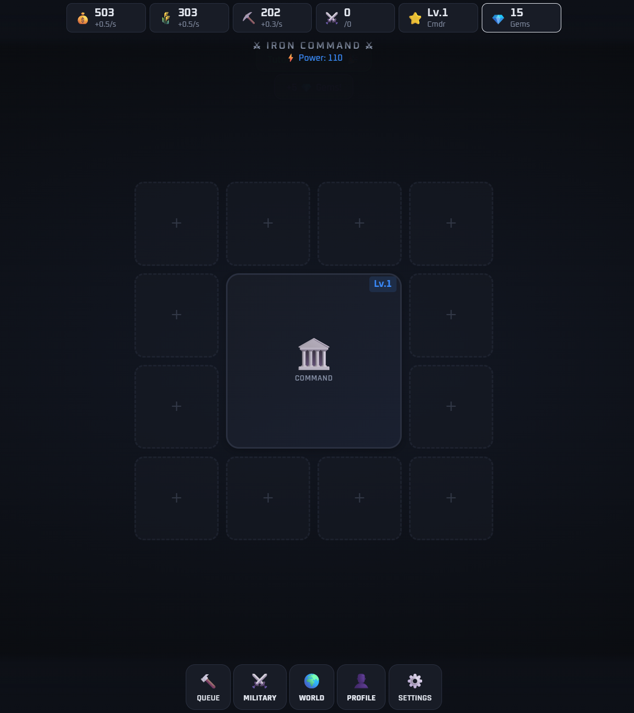
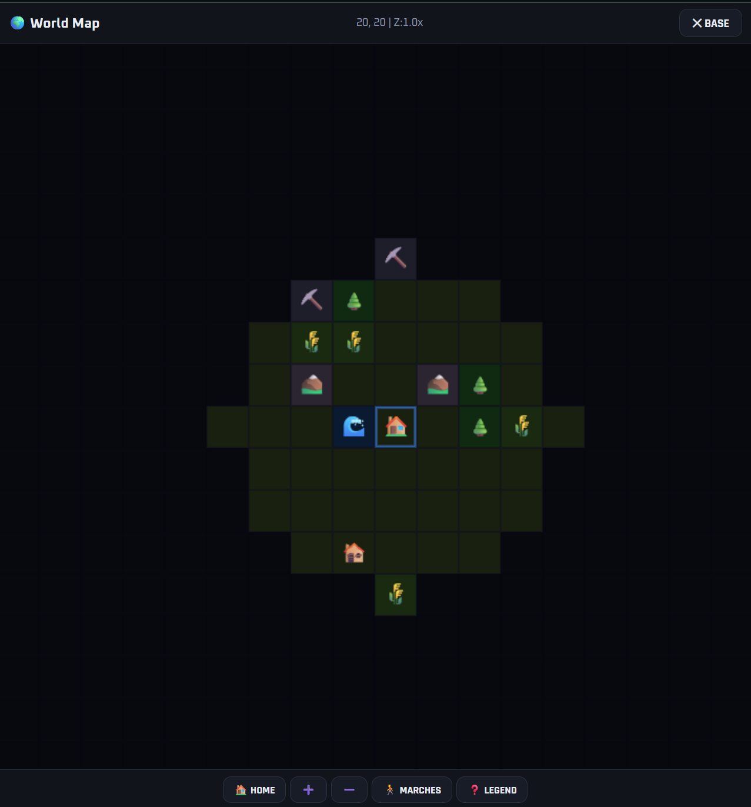

# ⚔️ Iron Command




**A mobile-first base-building strategy game built entirely in a single HTML file.**

Train armies, research technology, conquer the world map, recruit legendary heroes, and build your empire — all from your browser.

---

## 🎮 Play Now

Just open `iron-command.html` in any modern browser. That's it. No install, no server, no dependencies.

- **Desktop**: Chrome, Firefox, Edge, Safari
- **Mobile**: Any phone browser (Chrome, Safari, Samsung Internet)
- **Offline**: Works completely offline after first load

---

## 📸 Overview

Iron Command is a single-file HTML5 strategy game inspired by titles like Mobile Strike, Clash of Clans, and Rise of Kingdoms. It packs a full-featured strategy experience into ~2,300 lines of vanilla HTML/CSS/JavaScript with zero external dependencies (except Google Fonts).

### What's in the game:

- **Base Building** — 4×4 grid with 8 building types, upgradeable to level 10
- **Resource Economy** — Gold, Food, Iron generation with storage limits
- **Research Lab** — 3-branch tech tree (Economy, Military, Defense) with 12+ technologies
- **Army System** — 4 troop types (Infantry, Vehicles, Artillery, Air), bulk training, hospital healing
- **15-Mission Campaign** — PvE auto-battle with loot and XP rewards
- **40×40 World Map** — Canvas-rendered with pan/zoom, fog of war, resource tiles, 5 NPC base types
- **March System** — Send up to 3 simultaneous marches with travel time
- **8 Recruitable Heroes** — Passive bonuses affecting combat, building, research, and economy
- **Gems Economy** — Premium currency earned through gameplay, used for speed-ups and hero recruitment
- **Timed Events** — Resource Rush, War Games, and Raid Boss encounters
- **Alliance System** — Create and name your clan (solo placeholder for future multiplayer)
- **18 Achievements** — Permanent badges across building, combat, research, and exploration milestones
- **Sound Effects** — 20+ Web Audio API synthesized sounds (toggleable)
- **Particle Effects** — Canvas sparkle bursts for key moments
- **Interactive Tutorial** — 6-step guided onboarding for new players
- **3 Save Slots** — With preview cards, auto-backup, export/import via base64

---

## 🏗️ Architecture

The entire game lives in one self-contained HTML file:

```
iron-command.html    ← Everything: HTML, CSS, JavaScript, game logic, data
PROJECT_ROADMAP.md   ← Development roadmap and stage tracking
CHANGELOG.md         ← Version history with detailed change notes
README.md            ← You are here
```

### Technical Highlights

| Component | Implementation |
|---|---|
| Rendering | HTML/CSS UI + HTML5 Canvas (world map, particles) |
| Audio | Web Audio API oscillator synthesis (no audio files) |
| Storage | localStorage with 3 save slots + auto-backup |
| Portability | Base64 export/import for cross-device transfer |
| Touch Support | Full mobile touch handling (drag, pan, tap detection) |
| Fonts | Google Fonts (Rajdhani + Oxanium) |
| Dependencies | Zero. Vanilla JS only. |

### Game State

All game data lives in a single `GS` (Game State) object, serialized to localStorage as JSON. Save format is versioned (currently v6) with automatic migration from older formats.

---

## 🎯 Game Systems

### Resources & Buildings
Three core resources (Gold, Food, Iron) generated by buildings on a 4×4 base grid. 8 building types: Command Center (HQ), Gold Mine, Farm, Iron Works, Barracks, Research Lab, Hospital, Warehouse. All upgradeable to level 10 with increasing costs and timers.

### Research
3-branch tech tree accessed via Research Lab: Economy (gathering, trade, storage, surplus), Military (training, tactics, armor, elite forces), Defense (walls, fortress, watchtower). Each tech has multiple levels with scaling costs.

### Combat
Auto-battle system with multi-round combat. Army strength calculated from troop stats × count × research bonuses × hero bonuses. 15 campaign missions with escalating difficulty. World map NPC bases range from Bandit Hideouts to Shadow Citadels.

### Heroes
8 heroes across 4 rarity tiers (Common → Legendary). Recruited with Gems, one equipped at a time. Bonuses apply globally to their respective systems: attack power, build speed, research speed, resource gathering, heal rate, and total power.

### Events
3 event types rotated manually: Resource Rush (2× production), War Games (2× battle loot), Raid Boss (cooperative damage to 10,000 HP boss). Events run for 1-2 hours with resource + gem rewards.

### World Map
Procedurally generated 40×40 tile grid with seeded RNG (consistent per save). 7 tile types including resource deposits. Fog of war revealed by marches and NPC defeats. Occupy resource tiles for passive income.

---

## 💾 Save System

- **3 Save Slots** — Main menu shows preview cards with HQ level, power, commander level, and time since last save
- **Auto-Save** — Every 30 seconds during gameplay
- **Auto-Backup** — Previous save preserved on every write; restorable from Settings
- **Export/Import** — Base64 encoded save data for clipboard transfer between devices
- **Migration** — Automatically upgrades saves from v1 through v6
- **Bulletproof Reset** — Requires typing "RESET" to confirm; per-slot or global wipe

---

## 🔊 Audio

All sounds are generated at runtime using the Web Audio API — no audio files needed. 20+ distinct sound types organized by intensity:

- **Subtle UI**: tap, tab switch, open/close panels
- **Medium Feedback**: click, coin, queue, build complete, research complete
- **Important Events**: battle, victory, defeat, achievement, level up, raid boss

All sounds are short (35ms – 500ms), low volume (0.02 – 0.07 gain), and throttled to prevent stacking. Toggle on/off in Settings.

---

## 📱 Mobile Support

The game is designed mobile-first with:

- Touch-optimized fan popup menus (consolidated from 9 buttons to 5 groups)
- Canvas touch handling with tap vs. drag detection (20px + 400ms thresholds)
- Responsive layout with `100dvh` for mobile browser address bar handling
- Resource bar with tap-to-open panels
- No pinch-to-zoom conflicts on world map

---

## 🛣️ Development Roadmap

| Stage | Description | Status | Version |
|---|---|---|---|
| 1 | Base Building Foundation | ✅ Complete | v0.1.0 |
| 2 | Research, Commander & Quests | ✅ Complete | v0.2.0 |
| 3 | Army & Combat PvE | ✅ Complete | v0.3.0 |
| 4 | World Map & Exploration | ✅ Complete | v0.4.0 |
| 5 | Enhanced Persistence & Polish | ✅ Complete | v0.5.0 |
| 6 | Gameplay Depth & Visual Polish | ✅ Complete | v0.6.0 |
| 7 | Further Polish & PWA | 🔲 Planned | — |
| 8 | Standalone Apps & Distribution | 🔲 Planned | — |

See `PROJECT_ROADMAP.md` for detailed feature lists per stage.
See `CHANGELOG.md` for version-by-version change notes.

---

## 🚀 Future Plans

- **PWA Support** — Installable to phone home screen with offline service worker
- **Visual Polish** — Idle building animations, smoother transitions
- **Multiplayer** — Backend server, shared world map, PvP, alliance wars (requires Node.js + database)
- **Android APK** — Via Apache Capacitor wrapper
- **Desktop App** — Via Electron (optional)

---

## 🛠️ Development

No build step. No compiler. No package manager. Edit `iron-command.html` in any text editor and refresh your browser.

```bash
# "Build" process:
open iron-command.html

# That's it. That's the build process.
```

### Project Stats (v0.6.0)

- **~2,300 lines** of HTML/CSS/JavaScript
- **152 functions**
- **20+ sound effects** (synthesized)
- **8 building types**, **4 troop types**, **8 heroes**
- **12+ technologies** across 3 research branches
- **15 campaign missions**, **5 NPC base types**
- **18 achievements**, **3 event types**
- **40×40 world map** with fog of war
- **Zero dependencies**

---

## 📄 License

This project is a personal hobby game. All rights reserved.

---

## 🙏 Credits

Built with vanilla HTML5, CSS3, and JavaScript.
Fonts: [Rajdhani](https://fonts.google.com/specimen/Rajdhani) and [Oxanium](https://fonts.google.com/specimen/Oxanium) via Google Fonts.
Audio: Web Audio API.
No frameworks. No libraries. No excuses.
